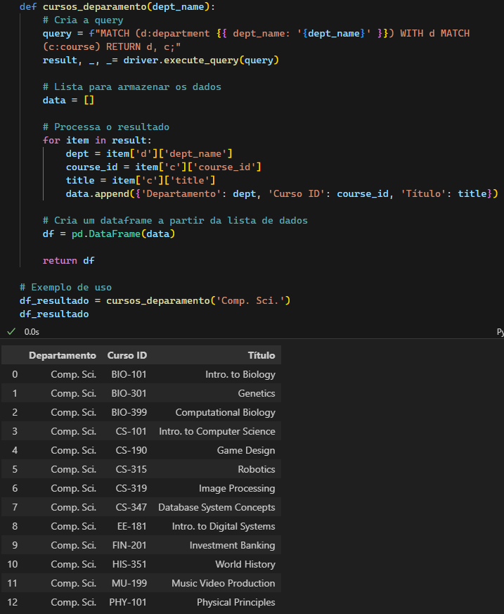
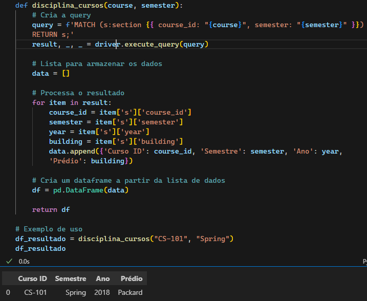
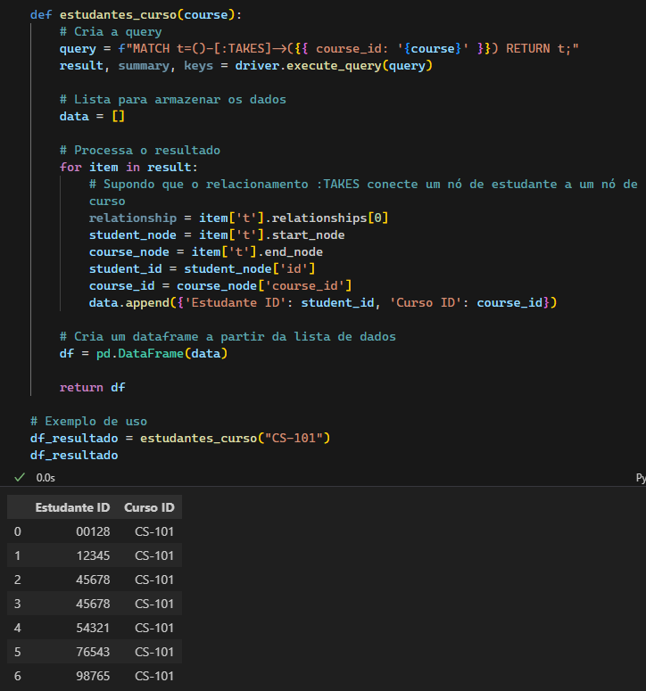
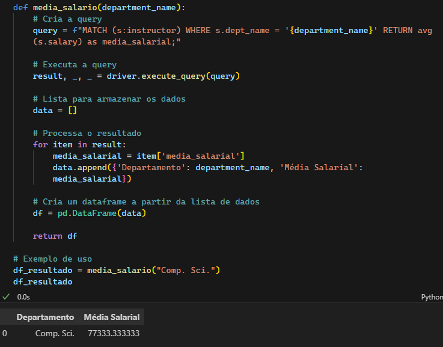
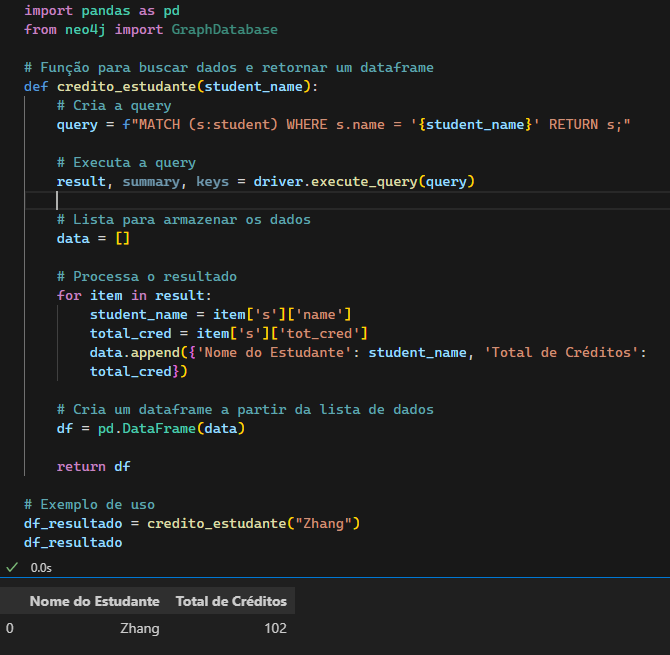
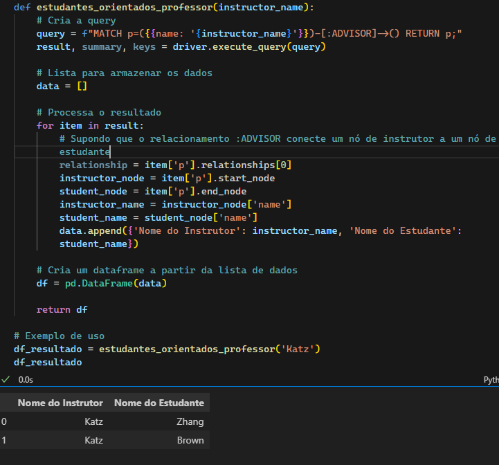
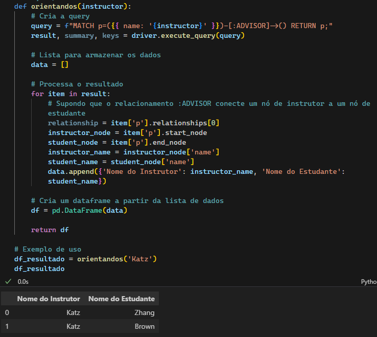

### Questão 1 - Listar todos os cursos oferecidos por um determinado departamento

### Questão 2 - Recuperar todas as disciplinas de um curso específico em um determinado semestre

### Questão 3 - Encontrar todos os estudantes que estão matriculados em um curso específico

### Questão 4 - Listar a média de salários de todos os professores em um determinado departamento

### Questão 5 - Recuperar o número total de créditos obtidos por um estudante específico

### Questão 6 - Encontrar todas as disciplinas ministradas por um professor em um semestre específico

### Questão 7 - Listar todos os estudantes que têm um determinado professor como orientador

### Questão 8 - Recuperar todas as salas de aula sem um curso associado

### Questão 9 - Encontrar todos os pré-requisitos de um curso específico

### Questão 10 - Recuperar a quantidade de alunos orientados por cada professor

